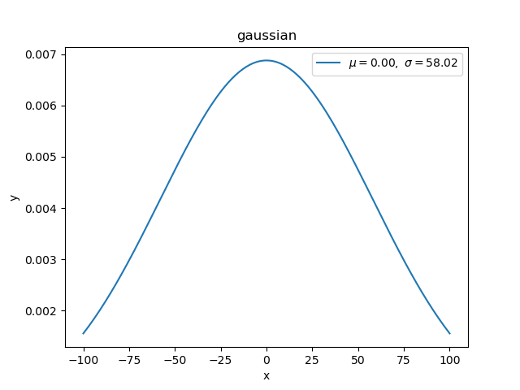

## How to understand Distribution

### Basic
- **随机变量**是可以随机取到一些离散值（离散型）或在一个区间范围内（连续型）取值的变量
- 离散型分布指的是随机变量的**概率质量函数（PMF）**，即衡量每个随机变量取到相应值的概率，随机变量某一处取值为0-1
- 连续型分布指的是随机变量的**概率密度函数（PDF）**，这里随机变量在某一处的取值可以大于1，但是在任意一个子区间积分才是概率，位于0-1
- 随机变量概率（密度）计算公式形式`y = f(x)`，x是随机变量，也是其概率分布
- 均值和方差这些统计信息是针对随机变量的，不是针对随机变量的概率分布的，即：`E(x), D(x)`；而不是`E(y), D(y)`

### Overview

- `conjugate` means it has relationship of **conjugate distributions**.

  > In [Bayesian probability](https://en.wikipedia.org/wiki/Bayesian_probability) theory, if the [posterior distributions](https://en.wikipedia.org/wiki/Posterior_probability) *p*(*θ* | *x*) are in the same [probability distribution family](https://en.wikipedia.org/wiki/List_of_probability_distributions) as the [prior probability distribution](https://en.wikipedia.org/wiki/Prior_probability_distribution) *p*(θ), the prior and posterior are then called **conjugate distributions,** and the prior is called a **conjugate prior** for the [likelihood function](https://en.wikipedia.org/wiki/Likelihood_function). [Conjugate prior, wikipedia](https://en.wikipedia.org/wiki/Conjugate_prior)

- `Multi-Class` means that Random Varivance are more than 2.

- `N Times` means that we also consider prior probability P(X).

### Distribution probabilities and features

1. **Uniform distribution(continuous)** 
   - 均匀分布【连续型】：均匀分布在 [a，b] 上具有相同的概率值，是简单概率分布。
   - [Code](uniform.py)
   
     

2. **Bernoulli distribution(discrete)**
   - 伯努利分布（0-1分布）【离散型】：先验概率 p（x）不考虑伯努利分布。因此，如果我们对最大似然进行优化，那么我们很容易被过度拟合。
   - [Code](bernoulli.py)

     

3. **Binomial distribution(discrete)**
   - 二项分布【离散型】：参数为 n 和 p 的二项分布是一系列 n 个独立实验中成功次数的离散概率分布。二项式分布是指通过指定要提前挑选的数量而考虑先验概率的分布。
   - [Code](binomial.py)

     

4. **Multi-Bernoulli distribution, Categorical distribution(discrete)**
   - 多伯努利称为分类分布【离散型】。交叉熵和采取负对数的多伯努利分布具有相同的形式。
   - [Code](categorical.py)

     

5. **Multinomial distribution(discrete)**
   - 项式分布【离散型】：与分类分布的关系与伯努尔分布与二项分布的关系相同，这里以三项分布为例。
   - [Code](multinomial.py)

     

6. **Beta distribution(continuous)**
   - β分布【连续型】与二项分布和伯努利分布共轭。利用共轭，利用已知的先验分布可以更容易地得到后验分布。
   - [了解更多](beta.py)
   
     

7. **Dirichlet distribution(continuous)**
   - dirichlet 分布与多项式分布是共轭的。如果 k=2，则为β分布, 这里以 k=3为例。
   - [了解更多](https://baike.baidu.com/item/%E7%8B%84%E5%88%A9%E5%85%8B%E9%9B%B7%E5%88%86%E5%B8%83/12728892)
   - [Code](dirichlet.py)

     

8. **Gamma distribution(continuous)**
   - 伽马分布【连续型】：假设随机变量X为等到第 a 件事发生所需的等候时间, b 为事情发生一次的概率, 指数分布和卡方分布是伽马分布的特例。
   - [了解更多](https://zhuanlan.zhihu.com/p/105482657)
   - [Code](gamma.py)

     

9. **Exponential distribution(continuous)**
   - 指数分布【连续型】是 α 为 1 时 gamma 分布的特例。
   - [Code](exponential.py)

     

10. **Gaussian distribution(continuous)**
    - 高斯分布【连续型】是一种非常常见的连续概率分布。
    - [Code](gaussian.py)

      

11. **Normal distribution(continuous)**
    - 正态分布【连续型】为标准高斯分布，平均值为0，标准差为1。
    - [Code](normal.py)

      

12. **Chi-squared distribution(continuous)**
    - 卡方分布【连续型】是 β 分布的特例。k 自由度的卡方分布是 k 个独立标准正态随机变量的平方和的分布。
    - [了解更多](https://www.zhihu.com/question/304500591)
    - [Code](chi_squared.py)

      

13. **Student-t distribution(continuous)**
    - t分布【连续型】是对称的钟形分布，与正态分布类似，但尾部较重，这意味着它更容易产生远低于平均值的值。
    - [了解更多](https://blog.csdn.net/kdazhe/article/details/105378229)
    - [Code](student-t.py)

      

### Relationship of distribution probability

© [JackHCC](https://github.com/JackHCC)

